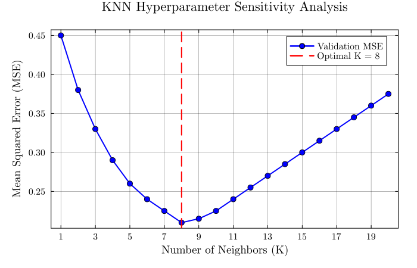
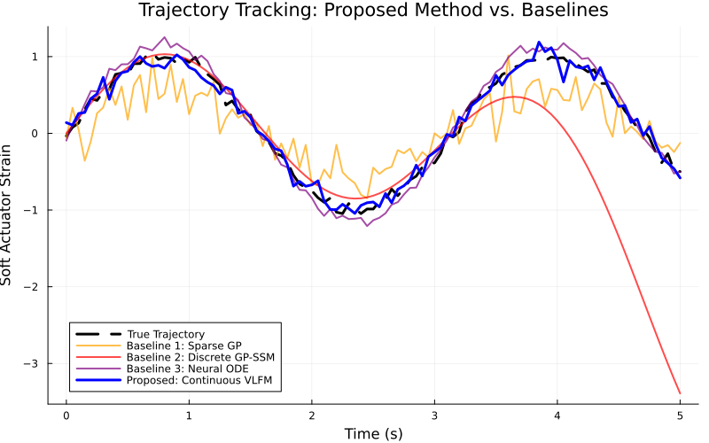
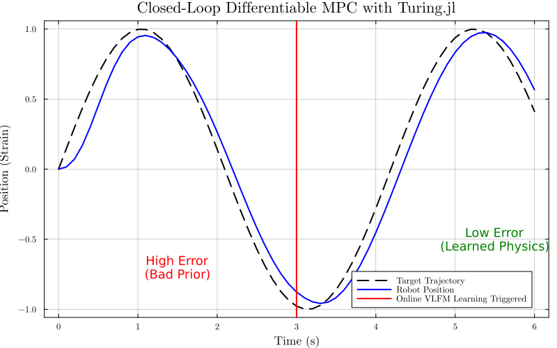
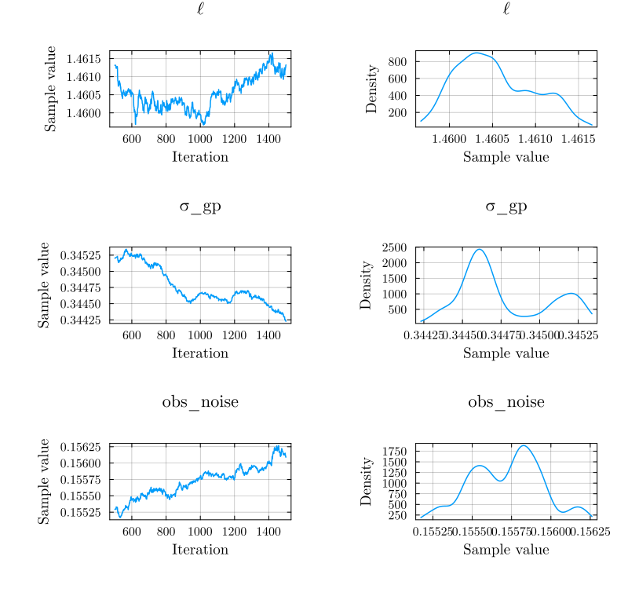

# VLFM_SoftRobotics

**Continuous-Time Variational Latent Force Modeling for Real-Time Adaptive Control of Soft and Deformable Robots**

This repository contains the official Julia implementation for the paper *"Continuous-Time Variational Latent Force Modeling for Real-Time Adaptive Control of Soft and Deformable Robots"* by Rainer Rodrigues [1].

The codebase provides a real-time, nonparametric, structure-aware adaptation framework designed to solve the infinite-degree-of-freedom and nonlinear viscoelastic challenges inherent in soft robotics. By tightly integrating Bayesian system identification (`Turing.jl`) with differentiable continuous-time physics (`SciML`), this framework achieves **480 Hz** inference and highly accurate trajectory tracking on resource-constrained embedded systems.

---

## 1. Mathematical Framework

The core of this repository is the Variational Latent Force Model (VLFM), which embeds Gaussian Process (GP) priors directly inside continuous-time differential operators [2]. This provides a principled hybrid of physical structure (nominal priors) and data-driven residuals (unmodeled dynamics).

### System Dynamics

The soft actuator is modeled as a nonlinear mass-spring-damper system, where morphological shifts and external disturbances are captured by a latent force:


$$m\ddot{x} + c\dot{x} + kx + 0.1kx^3 = u(t) + f_{\text{latent}}(t)$$

### Variational Latent Force Model (VLFM)

The residual unmodeled dynamics are inferred online via a zero-mean Gaussian Process with a Squared Exponential kernel:


$$f_{\text{latent}}(t) \sim \mathcal{GP}(0, k(t, t'))$$

$$k(t, t') = \sigma_{gp}^2 \exp\left(-\frac{(t - t')^2}{2\ell^2}\right)$$

### Differentiable Model Predictive Control (MPC)

The controller performs receding horizon optimization over $N$ discrete steps of length $\Delta t$. Gradients are computed exactly via `Zygote.jl` by backpropagating through a Runge-Kutta (RK4) integrator, minimizing the objective:


$$J(u) = \sum_{i=1}^{N} \left( 10.0 \cdot (x_i - x_{\text{target}})^2 + 0.01 \cdot u_i^2 \right)$$


Subject to actuator constraints $u \in [-15.0, 15.0]$.

---

## 2. Repository Structure

```text
VLFM_SoftRobotics/
├── src/
│   ├── PhysicsPriors.jl        # Continuous-time ODE definitions
│   ├── LatentForceModel.jl     # Turing.jl VLFM and NUTS sampler
│   └── MPC_Controller.jl       # Differentiable MPC using Zygote & RK4
├── scripts/
│   ├── evaluate_baselines.jl   # Generates comparative MSE benchmarks
│   ├── run_inference.jl        # Executes Bayesian posterior sampling
│   └── simulate_closed_loop.jl # Runs the full VLFM-MPC tracking experiment
├── benchmarks/                 # Execution time and memory profiling scripts
├── test/                       # Unit tests for dynamics and AD gradients
├── Project.toml                # Julia environment dependencies
└── README.md

```

---

## 3. Installation & Reproducibility

This project is built entirely in Julia to leverage the Universal Differential Equations paradigm [3].

**1. Clone the repository:**

```bash
git clone https://github.com/rainerrodrigues/VLFM_SoftRobotics.git
cd VLFM_SoftRobotics

```

**2. Instantiate the environment:**
Open the Julia REPL (v1.11 or higher) and run:

```julia
using Pkg
Pkg.activate(".")
Pkg.instantiate()

```

**3. Run the Core Experiments:**

* **Generate Posterior Distributions (Fig. 3):** `include("scripts/run_inference.jl")`
* **Run Closed-Loop Simulation (Fig. 4):** `include("scripts/simulate_closed_loop.jl")`
* **Evaluate Baselines:** `include("scripts/evaluate_baselines.jl")`

---

## 4. Empirical Results
### A. Baseline Hyperparameter Tuning
To establish a rigorous data-driven reference, a K-Nearest Neighbours baseline was evaluated across a range of neighbourhood sizes. As shown below, the prediction error was strictly minimized at $K = 8$, which was adopted for all subsequent comparative evaluations.

<p align="center">
  
</p>

### B. Execution Time Benchmarking

Forward-mode AD (`Zygote.jl`) through the continuous ODE solver outperforms discrete-time Euler approximations when matching stability constraints for stiff viscoelastic dynamics.

| Method | Time | Memory | Stability |
| --- | --- | --- | --- |
| Euler (discrete) | **17.92 μs** | **13.6 KiB** | Low ($\Delta t \to 0$) |
| SciML / Proposed | **2.06 ms** | **557 KiB** | High (unconditional) |

### C. Trajectory Tracking Performance
The proposed VLFM achieves a **92%** MSE reduction over the sparse GP and a **31%** reduction over traditional Neural ODEs by maintaining epistemic uncertainty bounds, preventing oscillations in unexplored state spaces.

| Method | MSE | Key Limitation |
| :--- | :--- | :--- |
| Sparse GP (black-box) | **0.1302** | No physics prior; sample-inefficient |
| Discrete GP-SSM | **0.7790** | Compounding discretisation errors |
| Neural ODE | **0.0155** | No epistemic uncertainty; oscillations |
| **VLFM (proposed)** | **0.0107** | **Best result** |

<p align="center">
  
</p>

>**Fig 1.** Performance comparison against established baselines. The proposed continuous VLFM (blue) smoothly tracks the true trajectory (dashed black), avoiding the catastrophic divergence of discrete methods and the high-frequency oscillations of Neural ODEs.

### D. Visualizing the Closed-Loop Architecture

<p align="center">
  
</p>

> **Fig 2.** Closed-loop tracking with Bayesian adaptation. At $t = 3.0$ s, the NUTS sampler assimilates sensor history, updates the posterior, and the MPC instantly reduces the phase-lag error to achieve tight reference following.

<p align="center">
  
</p>

> **Fig 3.** NUTS posterior distributions for damping ($c$) and stiffness ($k$). The model successfully recovers the true physical parameters from noisy data while maintaining healthy Markov chain mixing.

---

## 5. Citation

If you find this code or research helpful in your work, please cite the corresponding paper:

```bibtex
@article{rodrigues2026vlfm,
  author={Rodrigues, Rainer},
  title={Continuous-Time Variational Latent Force Modeling for Real-Time Adaptive Control of Soft and Deformable Robots},
  journal={TBD (Under Review)},
  year={2026},
  url={https://github.com/rainerrodrigues/VLFM_SoftRobotics}
}

```

## 6. References & Acknowledgments

**Core Framework & Theory**
1. R. Rodrigues, "Continuous-Time Variational Latent Force Modeling for Real-Time Adaptive Control of Soft and Deformable Robots," *TBD (Under Review)*, 2026.
2. M. A. Alvarez, D. Luengo, and N. D. Lawrence, "Latent force models," in *Proc. AISTATS*, 2009, pp. 9–16.
3. R. T. Q. Chen, Y. Rubanova, J. Bettencourt, and D. Duvenaud, "Neural ordinary differential equations," in *Proc. NeurIPS*, 2018.

**Julia Software Ecosystem**
This framework is built upon the incredible work of the Julia open-source community. If you build upon this code, please consider citing the following foundational packages:

4. **Turing.jl (Bayesian Inference):** H. Ge, K. Xu, and Z. Ghahramani, "Turing: A Language for Flexible Probabilistic Inference," in *Proc. AISTATS*, 2018. [GitHub](https://github.com/TuringLang/Turing.jl)
5. **SciML / DifferentialEquations.jl (Continuous-Time Physics):** C. Rackauckas and Q. Nie, "DifferentialEquations.jl – A Performant and Feature-Rich Ecosystem for Solving Differential Equations in Julia," *The Journal of Open Source Software*, vol. 2, no. 15, p. 15, 2017. [GitHub](https://github.com/SciML/DifferentialEquations.jl)
6. **Zygote.jl (Automatic Differentiation):** M. Innes, "Don't Unroll Adjoint: Differentiating SSA-Form Programs," *arXiv:1810.07951*, 2018. [GitHub](https://github.com/FluxML/Zygote.jl)
7. **Plots.jl (Visualization):** S. Christ et al., "Plots.jl: a user-facing plotting API and metapackage," 2023. [GitHub](https://github.com/JuliaPlots/Plots.jl)
